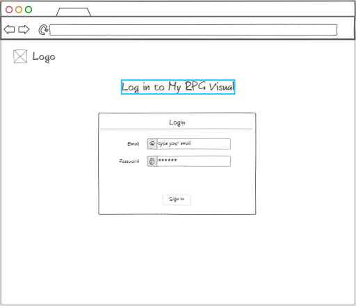
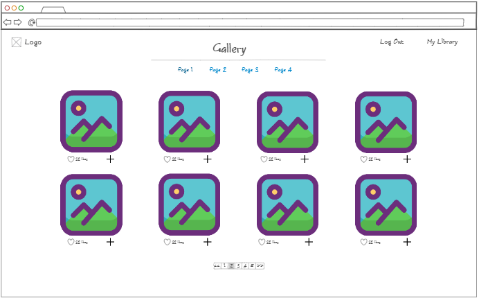
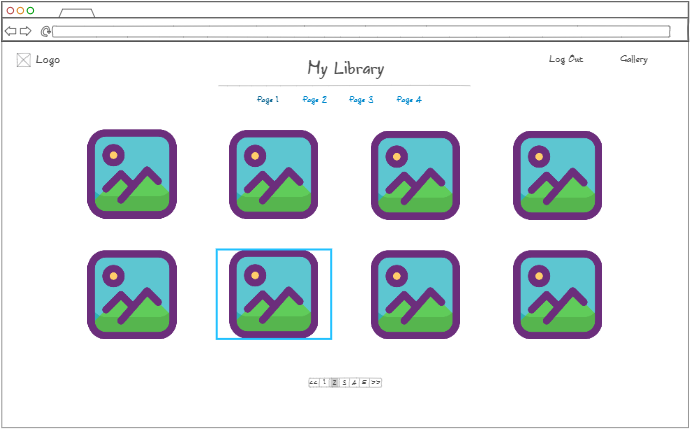
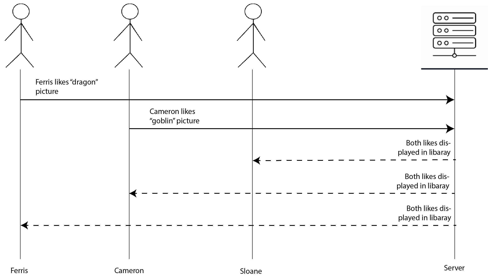

## Elevator Pitch
---
Have you ever wanted pictures of cool things like dragons, faries or goblins without having to slog through the turpid mire of the internet? My RPG Visual can help. Brows a family-friendly library of only fantasy applicable images and save the ones you would like to use later. You can see in real time how many people like each image! You can even upload your own images if our library dosen't meet your needs.

## Design
---
### Login Page: 

### Gallery Page: 

### Library Page: 

### Here is a diagram of how the users interact with the server: 

## Key Features
---
- Https login
- The ability to browse a library of images stored in an AWS S3 Bucket
- The ability to like an image
- Likes for all images displayed in real time
- The ability to save an image to your personal library
- The ability to upload an image to your personal library

## Technologies
---

I am planning to use all the required technologies in these ways

- **HTML** - Use proper structure for HTML pages with hyperlinks between each page.
- **CSS** - Use CSS to create dynamic layouts with a clean design that facilitates the visual nature of the app
- **JavaScript** - Use Javascript to login, fetch image URLs from the database, make requests to the server when images are added to the library or uploaded, and update likes in real time
- **Service** - Backend service with endpoints for:
  - login
  - fetch images
  - add image to a user library table in the DB
  - Get all of the images related to filters the user selects
- **DB/Login** - I will store info related to users, their image libraries, and their liked images in the DB. I will also store all of the image URLs for the Gallery here.
- **WebSocket** - As a user likes an image, that like will update in real-time for all the other users on images that they are viewing
- **React** - Use the react framework for final application

## HTML deliverable

My application structure has been built using HTML

- **HTML pages** - 5 HTML pages that will be the login and account creation system, image gallery and personal image library pages.
- **Links** - Links between all the pages containing the functionality for the site are in the header to each page. Link to the 'create account' flow is tied to the 'create account' button in index.html
- **Text** - Each image and spots to like the images are represented by short descriptions of the names and number of likes. A good example is the gallery.html page.
- **Images** - Right now I'm using 'img_placeholder.png' (See gallery.html and my-library.html) as a placeholder for all the images in my website. I've got an S3 bucket set up to store and retrieve the images eventually.
- **DB/Login** - I have a username, password box, and submit button for login (index.html). User data, including a collection of URLs for the images on the my-library.html page are going to be stored on my DB.
- **3rd party service/API** - I plan to use a 3rd party service for email validation in the 'account confirmation' page.
- **WebSocket** - The likes on the images on the 'gallery.html' page will use a websocket to update in real-time

## CSS Deliverable
- **Properly styled CSS Header, footer, and main content body** - Styling for these elements is done using bootstrap and in the `CSS/style.css` file.
- **Properly styled CSS navigation elements** - Nav bar styled with bootstrap
- **Responsive to window sizing** - All pages dynamically adapt desktop, tablet and mobile sizes
- **Properly styled CSS application elements** - All elements are styled using bootstrap and supplemental CSS. Main site styles are in `CSS/style.css`, the CSS for the gallery elements in the `gallery.html` and `my-library.html` pages is in `CSS/gallery-style.css` and the styles for the account confirmation page are in `CSS/account-confirmation.css`.
- **Properly styled CSS application text content** - The bootstrap default font worked great for the design I had in mind.
- **Properly styled CSS application images** - All images on he `gallery.html` and `my-library.html` pages sized and bordered with css in `gallery-styles.css`